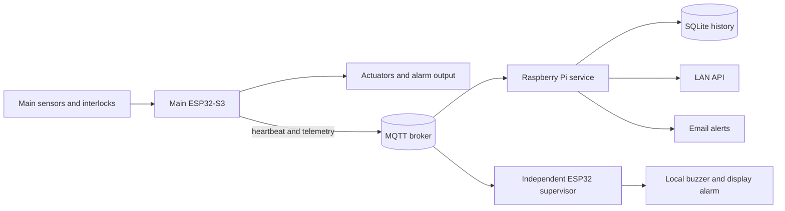

# TERRA v7 System Architecture

## 1. Design goals and authority

TERRA separates local safety from observation and remote access.

| Device | Authority | Can operate alone? | Primary responsibility |
| --- | --- | --- | --- |
| Main ESP32-S3 | Safety and climate authority | Yes | Read sensors, enforce interlocks, control actuators, publish state. |
| Independent ESP32 supervisor | Alarm authority for cross-checks | Partly | Verify the main controller and its environment; sound and publish alarms. It never commands climate outputs. |
| Raspberry Pi | Gateway and history | No | Store telemetry, expose the LAN API, and send asynchronous email alerts. |

The Pi and supervisor may report failures, but neither is allowed to become a hidden replacement climate controller. Loss of Wi-Fi, MQTT, the Pi, or the supervisor must not prevent the main ESP32 from enforcing its local safety rules.

## 2. Data flow

The main controller publishes heartbeat every 2 seconds and telemetry every 5 seconds. These are live, non-retained messages. On MQTT connection the controller clears legacy retained values; the Pi ignores empty tombstones and all retained messages so an old message cannot be treated as current. Keep health topics non-retained at the broker because MQTT consumers do not all expose retain metadata. The supervisor publishes alarm events when live and publishes a `NONE` event when an alarm clears.

## 3. Main controller

### 3.1 Inputs

The main firmware uses an ESP32-S3 and the following inputs:

| Input | Pin or bus | Meaning |
| --- | --- | --- |
| Soil moisture | GPIO 1 analog | Calibrated percentage between `SOIL_DRY=3200` and `SOIL_WET=1200`. |
| Reservoir level | GPIO 6, pull-up | `true` means reservoir low. |
| Drainage level | GPIO 7, pull-up | `true` means drainage level high. |
| Door reed | GPIO 10, pull-up | `true` means the door is open. |
| External DHT11 | GPIO 4 | Ambient temperature and humidity reference. |
| I2C bus | SDA 8, SCL 9 | TCA9548A and the upper/lower SHT4x sensors. |

The upper and lower SHT4x sensors share an address and are isolated through a TCA9548A at address `0x70`:

| Sensor | TCA channel | Published fields |
| --- | ---: | --- |
| External ambient DHT11 | GPIO 4 | `externalTemperatureC`, `externalHumidityPct` (Reference & failure check only) |
| Upper zone | 0 | `upperTemperatureC`, `upperHumidityPct` |
| Lower zone | 1 | `lowerTemperatureC`, `lowerHumidityPct` |

Temperature values outside -20 to 60 C and humidity values outside 0 to 100 percent are invalid. A failed or stale upper/lower climate sensor places climate outputs in the safe-off state. A failed or stale external DHT11 raises `EXTERNAL_SENSOR_FAULT` but does not disable climate control because it is a reference sensor.

### 3.2 Outputs

| Output | Pin | Protection or behavior |
| --- | ---: | --- |
| Mister pump | GPIO 11 | Door, water, drainage, climate-validity, temperature, cooldown, and maximum-runtime limits. |
| Fogger | GPIO 12 | Door, water, drainage, climate-validity, temperature, and maximum-runtime limits; it can run only while the mister is active or for a short post-mist wetting window. |
| Heater | GPIO 13 | Door, temperature, climate validity, lockout, minimum-off time, and maximum-runtime limits. A timeout lockout clears only after valid temperatures are back at or above the heater-off threshold. |
| Fan PWM | GPIO 14 | Door interlock and automatic duty selection. |
| Drainage pump | GPIO 15 | Starts on high drainage level and locks out after timeout until the level clears. A high drainage level also stops mister and fogger outputs immediately. |
| Food servo | GPIO 16 | Moves from rest to feed position and back, with a one-hour cooldown. |
| Alarm | GPIO 17 | Mirrors the active main-controller alarm. |
| Status LED | GPIO 18 | Heartbeat/status indication. |

`OUTPUT_ACTIVE_HIGH` controls the digital output polarity and fan PWM polarity. Hardware drivers must still provide the required current handling, isolation, suppression, and thermal protection.

### 3.3 Control loop

The controller reads sensors every 2 seconds and evaluates control every 250 ms. The control order is:

1. Read fast interlocks and enforce actuator timeouts.
2. Run the drainage response and lockout logic.
3. If an upper/lower climate input, soil reading, or level input is invalid or stale, stop mister, fogger, heater, and fan and raise `SENSOR_FAULT`. If the external DHT11 is invalid or stale, raise `EXTERNAL_SENSOR_FAULT` without disabling climate control.
4. If upper or lower zone temperature reaches 30 C, stop climate outputs except the emergency fan and raise `OVER_TEMP`.
5. If the door is open, stop mister, fogger, fan, and heater and raise `DOOR_OPEN`.
6. If the reservoir is low, stop mister and fogger and raise `WATER_LOW`.
7. In automatic mode, use soil-moisture hysteresis to control the mister. After a one-second wetting delay, run the fogger as a brief companion to misting; it never starts from humidity demand alone and may continue only through its five-second post-mist wetting window.
8. In automatic mode, heat only when upper and lower zone temperatures are at or below 22 C; stop when both are at or above 24 C.
9. Select baseline, high-humidity, or high-temperature fan duty.

Manual commands do not bypass hard interlocks. Manual mode disables automatic climate demand, but direct actuator requests still pass through door, sensor, water, drainage, temperature, lockout, and runtime checks. Manual mode expires after ten minutes without a manual command; the controller stops climate outputs, returns to automatic climate control, and raises a `MANUAL_TIMEOUT` alarm. The timeout is enforced by the main controller and therefore does not depend on the Pi or MQTT connection remaining available.

### 3.4 Safety limits

| Setting | Value |
| --- | ---: |
| Sensor stale interval | 10 s |
| Mister maximum on time | 5 s |
| Mister cooldown | 30 s |
| Fogger start delay after mister | 1 s |
| Fogger maximum on time | 5 s |
| Fogger post-mist wetting window | 5 s |
| Drainage maximum runtime | 120 s |
| Heater maximum runtime | 900 s |
| Heater minimum off time | 30 s |
| Feed cooldown | 3600 s |
| Hard temperature limit | 30 C |
| Emergency fan duty | 255 / 255 |

An independent hardware thermal cutoff remains required for the heater. Firmware protection is not a substitute for correctly rated hardware.

## 4. Independent supervisor

The supervisor is electrically and logically separate from the main controller. It watches:

- Main heartbeat freshness: 10 seconds.
- Main telemetry freshness: 15 seconds.
- Main upper versus lower gradient: maximum 8 C.
- Main alarm and reservoir state.

The supervisor produces local display and buzzer alarms including `MAIN_OFFLINE`, `TELEMETRY_STALE`, `MAIN_GRADIENT`, `RESERVOIR_LOW`, and `MAIN_ALARM`. It publishes supervisor alarms to `vivarium/supervisor/alarm` when live mode is enabled. External ambient temperature data from main telemetry is displayed for reference.

The display hardware is a CYD ESP32-2432S028R using LVGL, TFT_eSPI, and XPT2046. This is an implementation detail of the supervision device, not a system dependency: the main controller does not rely on the display being present.

## 5. Raspberry Pi service and dashboard

The Pi service connects to MQTT as `frog-pi-supervisor`, subscribes to the main heartbeat, main telemetry, main alarm, and supervisor alarm topics, and maintains an in-memory latest snapshot with receive ages. It stores telemetry and alarms in SQLite and sends alert emails through a bounded asynchronous worker with retries and per-code cooldown.

The service exposes authenticated endpoints on port 8080 and serves the dashboard from the same origin. The dashboard uses polling, displays live state and alarms, requests camera snapshots through the Pi when configured, and sends commands only through the validated API. It does not write directly to MQTT from browser code and does not claim that command publication equals physical actuator confirmation. See [Operations and API](OPERATIONS.md) for the complete contract.

## 6. Failure behavior

| Failure | Main controller | Supervisor | Pi |
| --- | --- | --- | --- |
| Wi-Fi unavailable | Continues local control and retries connection. | Cannot receive MQTT; local display/sensor functions continue. | MQTT data ages out and health reports stale data. |
| MQTT broker unavailable | Continues local control and retries connection. | Raises main-offline/stale alarms after timeout. | Reports disconnected and cannot publish commands. |
| Pi offline | No effect on local control. | No effect on local control. | History/API/alerts unavailable until restart. |
| Main controller offline | Actuators stop with the controller. | Raises `MAIN_OFFLINE`. | Heartbeat and telemetry become stale. |
| Upper/lower climate, soil, or level input invalid or stale | Climate outputs safe off; `SENSOR_FAULT` raised. | May raise stale or cross-check alarms. | Stores the published fault state. |
| External DHT11 invalid or stale | `EXTERNAL_SENSOR_FAULT` raised; climate control continues. | Receives the main alarm. | Stores the published alarm state. |
| Supervisor offline | No effect on local control. | N/A. | Main telemetry continues to be stored. |
